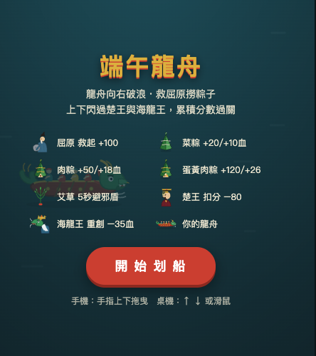

# 端午龍舟・救屈原

一個純前端的端午節龍舟小遊戲。玩家操控龍舟上下移動，救起屈原、收集粽子與艾草，並閃避楚王和海龍王。

## 線上遊玩

https://hchs200771.github.io/dragon-boat-game/

## 遊戲畫面



## 檔案結構

```text
.
├── index.html
├── styles.css
├── script.js
├── image.png
└── README.md
```

## 本機執行

直接用瀏覽器開啟 `index.html` 即可遊玩，不需要安裝套件或啟動伺服器。

## 操作方式

- 手機：手指上下拖曳
- 桌機：使用方向鍵 `↑` / `↓`，或滑鼠拖曳

## 部署到 GitHub Pages

1. 將專案推到 GitHub repository。
2. 到 repository 的 `Settings` → `Pages`。
3. Source 選擇 `Deploy from a branch`。
4. Branch 選擇 `main`，資料夾選擇 `/root`。
5. 儲存後等待 GitHub Pages 產生網址。
